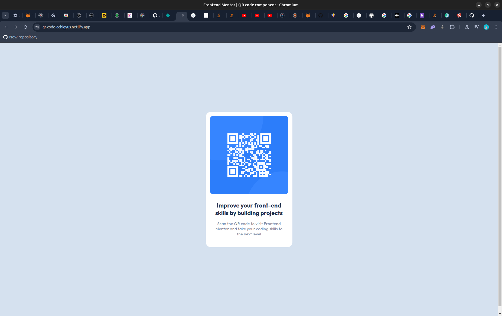

# Frontend Mentor - QR code component solution

This is a solution to the [QR code component challenge on Frontend Mentor](https://www.frontendmentor.io/challenges/qr-code-component-iux_sIO_H). Frontend Mentor challenges help you improve your coding skills by building realistic projects. 

## Table of contents

- [Overview](#overview)
  - [Screenshot](#screenshot)
  - [Links](#links)
- [My process](#my-process)
  - [Built with](#built-with)
  - [What I learned](#what-i-learned)
- [Author](#author)

**Note: Delete this note and update the table of contents based on what sections you keep.**

## Overview

### Screenshot

### Links

- Solution URL: [Github Repo](https://github.com/Achigyus/qr-code-component)
- Live Site URL: [Live Site](https://qr-code-achigyus.netlify.app/)

## My process

### Built with

- Semantic HTML5 markup
- CSS custom properties
- Flexbox
- Mobile-first workflow
- [React](https://reactjs.org/) - JS library

### What I learned

I learned about the horizontal overflow issue and how to solve it, you can read [this](https://www.smashingmagazine.com/2021/04/css-overflow-issues/) article to find out more about it. I also learnt about the ways that devs can use Figma if they can't pay for dev-mode, you can find that article [here](https://medium.com/@zubiduru/exploring-figma-dev-mode-alternatives-utilizing-advanced-features-without-constraints-0dbe5c90aa29)

## Author

- Website - [Achigyus](https://github.com/Achigyus)
- Frontend Mentor - [@Achigyus](https://www.frontendmentor.io/profile/Achigyus)
- Twitter - [@LaAnbuUchiha](https://x.com/LaAnbuUchiha)